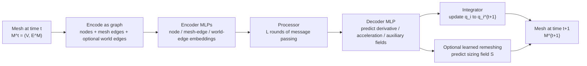
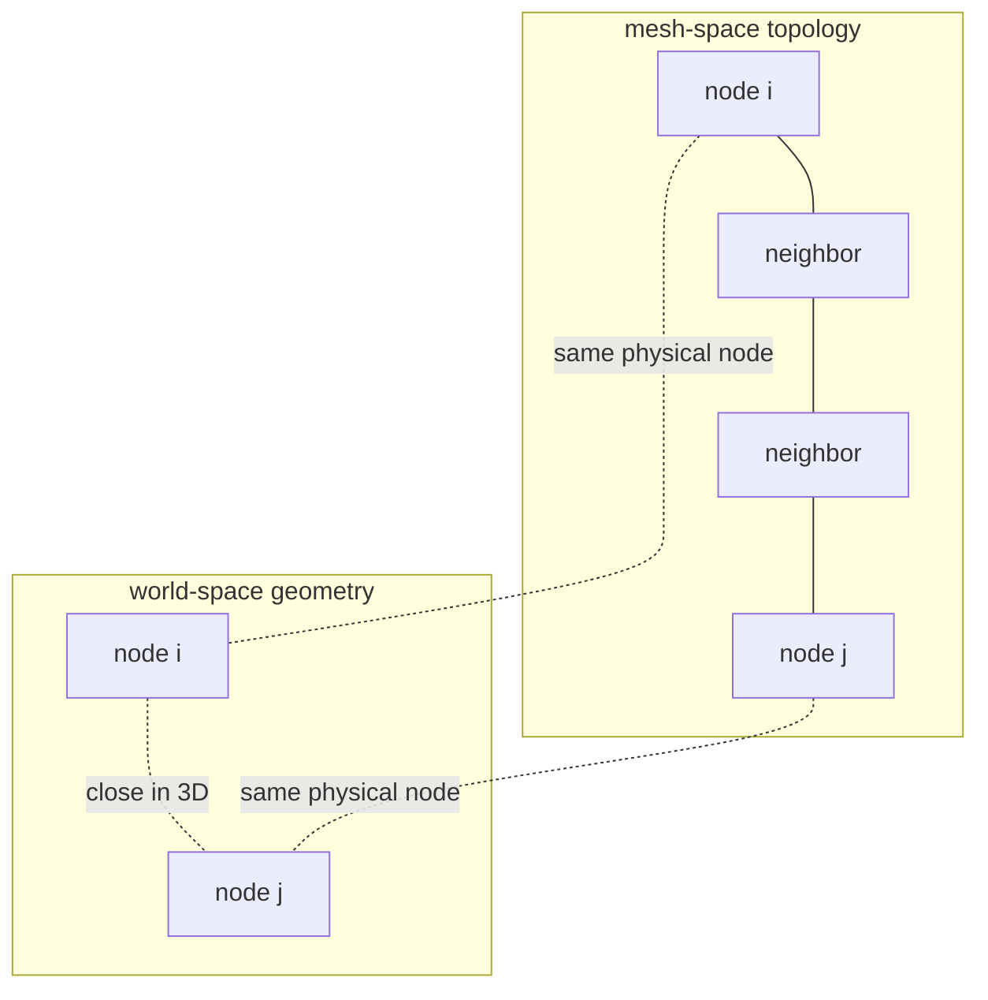
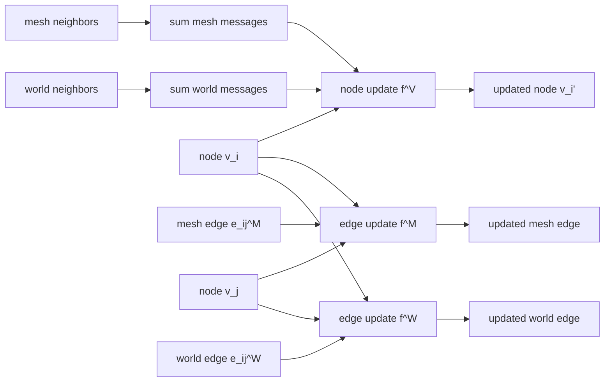
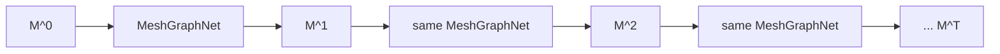
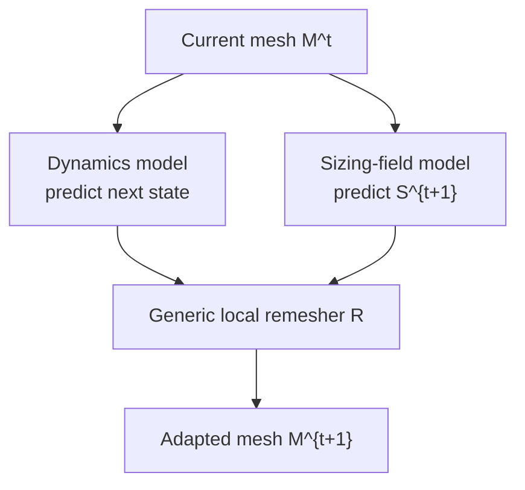
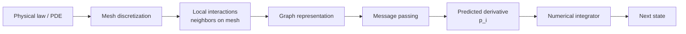

# Learning Mesh-Based Simulation with Graph Networks 论文梳理与可视化讲解

## 0. 论文信息

**论文题目**：Learning Mesh-Based Simulation with Graph Networks  
**模型名称**：MeshGraphNets  
**作者**：Tobias Pfaff, Meire Fortunato, Alvaro Sanchez-Gonzalez, Peter W. Battaglia  
**会议**：ICLR 2021  
**arXiv**：[arXiv:2010.03409](https://arxiv.org/abs/2010.03409)  
**DOI**：[10.48550/arXiv.2010.03409](https://doi.org/10.48550/arXiv.2010.03409)  
**项目主页**：[Learning mesh-based simulations](https://sites.google.com/view/meshgraphnets)  
**代码和数据**：[DeepMind meshgraphnets GitHub](https://github.com/google-deepmind/deepmind-research/tree/master/meshgraphnets)

这篇文章的核心贡献是提出 **MeshGraphNets**：把传统 mesh-based simulation 中的网格结构转成 graph，用 Graph Network 学习物理系统的时间演化，并支持动态自适应网格。

一句话总结：

```text
MeshGraphNets = mesh representation + graph neural network + learned forward dynamics + optional adaptive remeshing
```

---

## 1. 这篇文章想解决什么问题？

很多物理系统，例如流体、布料、结构力学、空气动力学，都可以用 PDE 和有限元/有限体积等方法模拟。传统模拟器很强，但有几个痛点：

- 高精度模拟很慢，尤其是大规模 3D 或高分辨率网格。
- 每类系统往往需要定制 solver、参数和网格策略。
- 规则 grid 适合 CNN，但真实工程问题常用不规则 mesh。
- 粒子模型适合自由流体、颗粒，但对有 rest-state 的材料、表面和体网格并不总是自然。
- 自适应网格很有用，但传统 remeshing 依赖领域启发式。

作者的想法是：

```text
既然 mesh 本来就是由节点和边组成的，
为什么不把 mesh 当成 graph，
用 GNN 来学习局部物理相互作用和时间推进？
```

---

## 2. 为什么 mesh 适合和 GNN 结合？

mesh 和 graph 的对应关系很直接：

| Mesh / Simulation | Graph / GNN |
|---|---|
| mesh vertex | graph node |
| mesh edge | graph edge |
| local neighborhood | message passing neighborhood |
| physical field on mesh | node feature |
| local differential operator | learned message aggregation |
| time stepping | recurrent rollout |
| adaptive mesh | dynamic graph |

直觉上，许多 PDE 都是局部相互作用：一个位置的状态变化主要由它附近的状态决定。GNN 的 message passing 正好提供了这种 inductive bias：

```text
local physical interaction ≈ messages along mesh edges
```

---

## 3. 整体框架可视化



读这篇文章时，最重要的主线是：

```text
当前 mesh state
→ graph representation
→ message passing
→ per-node physical update
→ integrator
→ next mesh state
→ repeat rollout
```

---

## 4. 状态表示：mesh、节点、边

论文把时间 `t` 的系统状态描述为：

```text
M^t = (V, E^M)
```

其中：

- `V` 是 mesh nodes。
- `E^M` 是 mesh-space edges。
- 每个节点 `i` 有 mesh-space coordinate `u_i`。
- 节点还带有要模拟的动态量 `q_i`。

不同系统对 `q_i` 的含义不同：

| 系统 | 动态量示例 |
|---|---|
| 布料或结构力学 | 位置、速度、加速度、应力 |
| 不可压流体 | 动量、压力 |
| 可压流体 | 动量、密度、压力 |
| 固定 Eulerian mesh | 网格固定，场变量在节点上变化 |
| 移动 Lagrangian mesh | 节点在 world-space 中移动 |

这里有两个空间概念很关键：

```text
mesh-space: 网格自身的拓扑/参考坐标空间
world-space: 真实物理空间中的几何位置
```

---

## 5. Mesh edges 和 world edges

MeshGraphNets 不只使用原始 mesh edge，还会在 Lagrangian 系统中加入 world-space edges。

### 5.1 Mesh edge

mesh edge 来自网格本身：

```text
(i, j) ∈ E^M
```

它表示两个节点在 mesh 拓扑上相邻。通过 mesh edge 传递消息，可以学习材料内部的局部动力学，比如弹性、弯曲、流体局部传播等。

### 5.2 World edge

world edge 根据真实空间距离添加：

```text
if ||x_i - x_j|| < r_W and (i, j) not in E^M:
    add (i, j) to E^W
```

它表示两个节点虽然在 mesh 拓扑上不相邻，但在真实空间中很接近。例如布料折叠后两个远端部分接触，mesh 上距离很远，但 world-space 中距离很近。

### 5.3 可视化



解释：

```text
mesh edge: 学内部连续介质动力学
world edge: 学接触、碰撞、自碰撞等非局部物理关系
```

这是这篇文章很漂亮的一个设计：同一个 GNN 同时在 mesh-space 和 world-space 两种关系上做 message passing。

---

## 6. 输入特征：如何保证空间等变性？

作者没有直接把绝对坐标作为边的核心几何特征，而是大量使用相对位移：

```text
u_ij = u_i - u_j
x_ij = x_i - x_j
```

并把范数也作为特征：

```text
||u_ij||, ||x_ij||
```

这样做的好处：

- 相对位移比绝对位置更适合学习局部物理规律。
- 如果整个系统平移，边的相对几何关系不变。
- GNN 更容易学习空间等变或近似等变的动力学。

输入大致可以整理为：

| 对象 | 特征 |
|---|---|
| node `v_i` | 动态量 `q_i`、node type one-hot、历史速度等 |
| mesh edge `e^M_ij` | `u_ij`, `||u_ij||`, 以及 Lagrangian 中的 `x_ij`, `||x_ij||` |
| world edge `e^W_ij` | `x_ij`, `||x_ij||` |

---

## 7. Encoder-Processor-Decoder

MeshGraphNets 使用典型的 Graph Network 架构：

```text
Encoder → Processor → Decoder
```

### 7.1 Encoder

Encoder 用 MLP 把原始 node/edge features 映射到 latent embeddings：

```text
v_i        → latent node embedding
e^M_ij     → latent mesh-edge embedding
e^W_ij     → latent world-edge embedding
```

论文中 node、mesh edge、world edge 分别使用不同的 encoder MLP。

### 7.2 Processor

Processor 是多轮 message passing。每一轮都会更新：

- mesh edge embedding
- world edge embedding
- node embedding

### 7.3 Decoder

Decoder 只从最后的 node embedding 输出 per-node prediction：

```text
p_i = decoder(v_i)
```

`p_i` 可以解释为：

- 一阶系统的变化量。
- 二阶系统的加速度。
- 或者辅助量，如压力、von-Mises stress。

---

## 8. Processor 的数学公式

一轮 message passing 可以写成：

```text
e'^M_ij ← f^M(e^M_ij, v_i, v_j)
e'^W_ij ← f^W(e^W_ij, v_i, v_j)
v'_i   ← f^V(v_i, Σ_j e'^M_ij, Σ_j e'^W_ij)
```

其中：

- `f^M` 是 mesh-edge update MLP。
- `f^W` 是 world-edge update MLP。
- `f^V` 是 node update MLP。
- `Σ_j e'^M_ij` 聚合所有 mesh neighbors 的消息。
- `Σ_j e'^W_ij` 聚合所有 world-space neighbors 的消息。

可视化：



这比普通 GCN 更灵活。GCN 通常做固定归一化邻居平均，而 MeshGraphNets 让 edge 和 node 都有可学习的 MLP 更新，并且显式区分 mesh edges 和 world edges。

---

## 9. 从 one-step prediction 到 long rollout

训练时，模型主要学一步预测：

```text
M^t → M^{t+1}
```

推理时，把模型递归应用很多次：

```text
M^0 → M^1 → M^2 → ... → M^T
```

可视化：



关键挑战是：

```text
训练只监督 one-step，但测试要稳定 rollout 很多步。
```

这类模型很容易误差累积。文章的强结果之一就是在多个系统上产生稳定长时序 rollout。

---

## 10. Integrator：预测导数而不是直接预测状态

Decoder 输出 `p_i`，然后用 forward Euler 风格的 integrator 更新状态。

### 10.1 一阶系统

如果系统是一阶：

```text
q_i^{t+1} = q_i^t + p_i
```

例如流体动量或密度的变化。

### 10.2 二阶系统

如果系统是二阶，`p_i` 可以解释为加速度：

```text
q_i^{t+1} = p_i + 2q_i^t - q_i^{t-1}
```

这类似于：

```text
new position = current position + velocity + acceleration
```

只是在论文中时间步长归一化为 `Δt = 1`。

---

## 11. Adaptive Remeshing：学习自适应网格

自适应网格的直觉：

```text
重要区域用更细的网格，不重要区域用更粗的网格。
```

例如：

- 布料弯曲很强的地方需要更多节点。
- 机翼附近或尾流区域需要更高分辨率。
- 边界层或高梯度区域需要更密的 mesh。

传统 adaptive remeshing 通常需要人为启发式。MeshGraphNets 的做法是学习一个 sizing field。

### 11.1 Sizing field

每个位置有一个 tensor：

```text
S(u) ∈ R^{2×2}
```

它表示局部允许的边长和方向。论文中边是否有效的条件是：

```text
u_ij^T S_i u_ij ≤ 1
```

如果：

```text
u_ij^T S_i u_ij > 1
```

这条边太长，需要 split；如果边可以安全 collapse，则用于 coarsening。

### 11.2 Learned remeshing 流程



核心意义：

```text
模型不用在推理时调用特定领域的 remeshing heuristic，
而是学习哪里应该细、哪里可以粗。
```

---

## 12. Training objective

动力学模型用 per-node L2 loss 训练：

```text
L_dyn = Σ_i ||p_i - p_i_bar||_2^2
```

其中：

- `p_i` 是模型输出。
- `p_i_bar` 是 ground-truth simulator 提供的目标变化量或导数。

Sizing field model 也用 L2 loss：

```text
L_size = Σ_i ||S_i - S_i_bar||_2^2
```

如果 simulator 没有显式给出 sizing field，论文还讨论了如何从 mesh 样本估计兼容的 sizing labels。

---

## 13. 实验系统

论文覆盖了多种系统，说明 MeshGraphNets 不是只针对单一物理场景。

| Dataset / Domain | 系统 | Mesh / 节点规模 | Ground-truth simulator |
|---|---|---|---|
| FlagDynamic | 布料风中摆动，自碰撞，动态 remeshing | 平均约 2767 nodes | ArcSim |
| SphereDynamic | 布料与球体接触，自碰撞和障碍碰撞 | 平均约 1373 nodes | ArcSim |
| DeformingPlate | 结构力学，超弹性板变形 | 约 1271 nodes | COMSOL |
| CylinderFlow | 圆柱绕流，不可压流体 | 约 1885 nodes | COMSOL |
| Airfoil | 机翼截面空气动力学，可压流体 | 约 5233 nodes | SU2 |

项目主页还展示了外推和泛化实验，例如：

- Airfoil 在更大攻角或更高 Mach number 下外推。
- FlagDynamic 训练在简单矩形布料上，测试到更复杂形状。
- WindSock 测试时节点数可到约 20k。

---

## 14. Baseline 比较

论文比较了几类替代方法：

| Baseline | 思路 | 为什么可能不够 |
|---|---|---|
| GNS | 粒子图模拟器 | 对 cloth / rest-state materials 和动态 mesh 不够自然 |
| GCN-MLP | 更接近传统 GCN 的图模型 | 固定聚合表达能力有限，难处理复杂动力学 |
| U-Net | 把数据重采样到规则 grid | 会损失不规则 mesh 的局部分辨率优势 |
| Steady-state GCN | 面向简单稳态预测 | 不等价于复杂动态 rollout |

论文主要结论：

```text
MeshGraphNets 在多个动态任务上比 particle / grid / GCN-style baselines 更稳定、更准确；
同时推理速度比 ground-truth simulator 快 1-2 个数量级。
```

---

## 15. 为什么 MeshGraphNets 比普通 GCN 更适合模拟？

普通 GCN 常见形式：

```text
H' = σ(A_hat H W)
```

它主要做归一化邻居平均和线性变换。

MeshGraphNets 更像一个 learned local solver：

```text
edge update: learn pairwise physical interaction
node update: aggregate forces / fluxes / local effects
decoder: convert latent state to derivative
integrator: advance physical state
```

关键差别：

| 普通 GCN | MeshGraphNets |
|---|---|
| 通常一个边类型 | mesh edges + world edges |
| 边不一定更新 | edge embeddings 显式更新 |
| 常用于分类 | 用于时间推进和 rollout |
| 常做平滑 | 学习局部物理交互 |
| graph 通常固定 | 可动态 remeshing |

---

## 16. 这篇文章的关键创新

### 16.1 把 mesh simulation 转化为 graph learning

文章不是简单把 mesh 当图，而是保留了 mesh-space 的物理含义，让 message passing 对应局部物理传播。

### 16.2 同时使用 mesh-space 和 world-space

mesh-space 负责内部动力学，world-space 负责接触和碰撞。

### 16.3 用 Encode-Process-Decode 学可泛化的动力学

模型学习的是局部规则，而不是固定大小输入输出映射，因此可以泛化到不同 mesh resolution 和更大系统。

### 16.4 支持 learned adaptive remeshing

模型可以预测 sizing field，用通用 remesher 调整网格分辨率。

### 16.5 高效率

推理速度显著快于训练用的传统模拟器，尤其适合需要大量 rollout 的场景。

---

## 17. 重要概念图：从 PDE 到 GNN



这张图是理解 MeshGraphNets 的钥匙：

```text
它不是直接替代物理概念，
而是把离散化后的局部更新规则交给 GNN 学习。
```

---

## 18. 读者容易卡住的点

### 18.1 mesh-space 和 world-space 不一样

mesh-space 是拓扑和材料参考空间；world-space 是真实几何位置。布料折叠时，两个点在 mesh-space 上可能很远，但在 world-space 中很近。

### 18.2 为什么要预测 derivative？

直接预测下一个状态容易违反时间连续性。预测变化量、速度或加速度，再用 integrator 更新，更像传统模拟器。

### 18.3 为什么 one-step training 能 long rollout？

理论上不保证。文章通过强 inductive bias、局部 message passing、合适的特征编码和训练策略，让误差在长 rollout 中不至于快速爆炸。

### 18.4 为什么 U-Net 不够？

U-Net 在规则 grid 上强大，但 mesh 可以在关键区域自适应加密。把 mesh 重采样到 grid 会牺牲不规则分辨率和几何结构。

### 18.5 为什么不是普通 GCN？

普通 GCN 更像平滑特征；MeshGraphNets 的 edge update、node update、不同 edge set 和 integrator 更接近 learned physics engine。

---

## 19. 和生物医学 GNN 的关系

虽然这篇论文是物理模拟，不是生物医学论文，但它对生物医学 GNN 很有启发。

### 19.1 组织、器官、细胞也可能是 mesh 或空间图

空间组学、病理图像、医学影像、脑网络、组织力学，都可能存在：

```text
spatial node + local relation + dynamic or functional state
```

MeshGraphNets 的思路可以启发：

- 组织切片中的 cell-cell spatial interaction。
- 肿瘤微环境中的局部传播。
- 脑区功能连接和结构连接联合建模。
- 心脏、肺、血流、组织形变等生物力学 surrogate model。
- 影像分割后的 anatomical graph 或 region graph。

### 19.2 重要启发

```text
不要只问“能不能用 GCN 分类”，
还要问“图上的边是否对应真实局部机制”。
```

这篇论文真正强的地方不是用了 GNN，而是图结构和物理机制高度匹配。

---

## 20. 如果自己复现，应该先实现什么？

最小复现路线：

```text
1. 选择一个简单 2D mesh dataset。
2. 把 mesh nodes 转为 graph nodes。
3. 把 mesh edges 转为 bidirectional graph edges。
4. 构建 edge features: relative displacement + distance。
5. 构建 node features: current field + node type。
6. 实现 encoder-processor-decoder。
7. 训练 one-step prediction。
8. 做 rollout 并观察误差累积。
9. 再加入 world edges。
10. 最后再考虑 adaptive remeshing。
```

优先级：

```text
forward dynamics > rollout stability > world edges > adaptive remeshing
```

---

## 21. 伪代码

```python
def meshgraphnet_step(mesh_state):
    graph = encode_mesh_as_graph(mesh_state)

    node_latent = node_encoder(graph.node_features)
    mesh_edge_latent = mesh_edge_encoder(graph.mesh_edge_features)
    world_edge_latent = world_edge_encoder(graph.world_edge_features)

    for block in processor_blocks:
        mesh_edge_latent = block.update_mesh_edges(
            mesh_edge_latent, node_latent, graph.mesh_edge_index
        )
        world_edge_latent = block.update_world_edges(
            world_edge_latent, node_latent, graph.world_edge_index
        )
        node_latent = block.update_nodes(
            node_latent, mesh_edge_latent, world_edge_latent
        )

    p = decoder(node_latent)
    next_state = integrator(mesh_state, p)
    return next_state
```

带 remeshing：

```python
def rollout_with_remeshing(mesh_state, steps):
    for t in range(steps):
        predicted_state = dynamics_model(mesh_state)
        sizing_field = sizing_model(mesh_state)
        mesh_state = generic_remesher(predicted_state, sizing_field)
    return mesh_state
```

---

## 22. 这篇文章的局限

- 它仍然依赖高质量 simulator 生成训练数据。
- 对训练分布外的极端物理情况仍可能失败。
- 长 rollout 稳定性是经验结果，不是严格物理守恒保证。
- 模型没有显式强制守恒律，除非通过特征、loss 或架构加入。
- adaptive remeshing 虽然减少领域启发式，但仍依赖 generic remesher。
- 对不同 mesh 类型、3D 大规模系统、边界条件变化，仍需要工程适配。

---

## 23. 应该如何评价这篇论文？

这篇文章的重要性在于它把 GNN 从“图上分类器”推进到“可学习的数值模拟器”：

```text
GNN 不只是 node classification / graph classification，
也可以学习 mesh 上的局部动力学更新规则。
```

它的研究品味在于：

- 没有抛弃传统 mesh representation。
- 没有盲目用 CNN 规则化所有问题。
- 没有把物理结构完全交给黑箱。
- 而是把 mesh 的 inductive bias 和 GNN 的可学习性结合起来。

---

## 24. 术语表

| 术语 | 中文解释 |
|---|---|
| mesh | 网格，由节点、边、面或单元组成的离散几何结构 |
| mesh-space | 网格参考空间或拓扑空间 |
| world-space | 真实物理几何空间 |
| MeshGraphNets | 论文提出的基于 graph network 的 mesh simulation 框架 |
| message passing | GNN 中邻居节点/边之间的信息传播 |
| Encode-Process-Decode | 编码、消息处理、解码的 Graph Network 架构 |
| rollout | 把一步预测模型递归应用，生成长时间轨迹 |
| sizing field | 自适应网格中控制局部分辨率的张量场 |
| remeshing | 改变网格节点和连接，使分辨率适应当前状态 |
| Eulerian | 网格固定，物理场在网格上变化 |
| Lagrangian | 网格随材料或物体运动 |
| PDE | 偏微分方程 |
| surrogate model | 用学习模型近似昂贵模拟器的替代模型 |

---

## 25. 推荐阅读顺序

如果你是从 GNN 入门读这篇文章，建议按下面顺序：

```text
1. 先理解 mesh → graph 的映射。
2. 再理解 mesh edges 和 world edges 的区别。
3. 再看 Encoder-Processor-Decoder。
4. 然后看 message passing 公式。
5. 接着看 decoder + integrator 如何产生下一步状态。
6. 最后看 adaptive remeshing 和实验结果。
```

读完后你应该能回答：

```text
为什么 MeshGraphNets 不是普通 GCN？
为什么 mesh representation 对物理模拟重要？
为什么 world edges 可以处理接触和碰撞？
为什么 learned remeshing 有助于效率和泛化？
这套思想如何迁移到生物医学空间图或动态图？
```

---

## 26. 来源

- Pfaff T, Fortunato M, Sanchez-Gonzalez A, Battaglia PW. **Learning Mesh-Based Simulation with Graph Networks**. ICLR 2021. [arXiv:2010.03409](https://arxiv.org/abs/2010.03409)
- 项目主页和视频：<https://sites.google.com/view/meshgraphnets>
- DeepMind 代码和数据：<https://github.com/google-deepmind/deepmind-research/tree/master/meshgraphnets>

